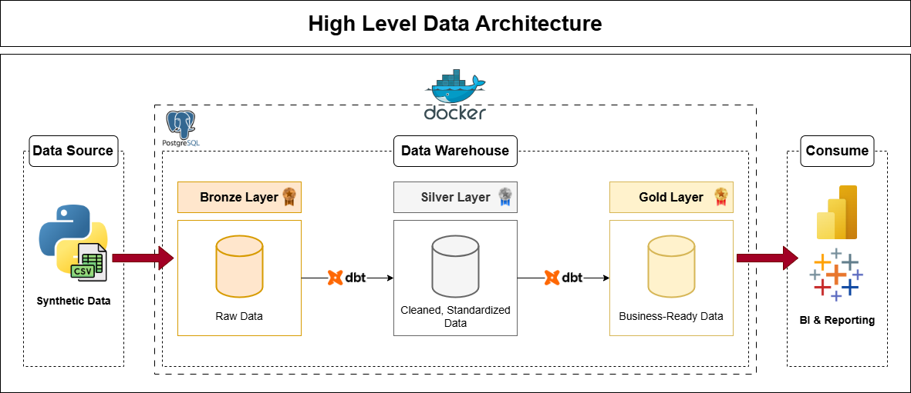
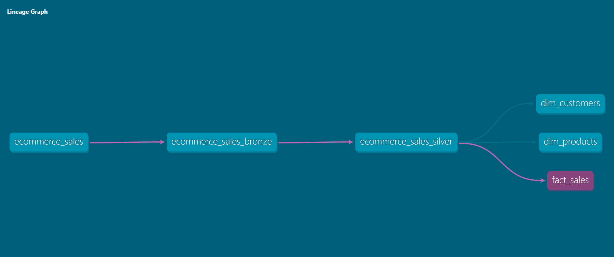
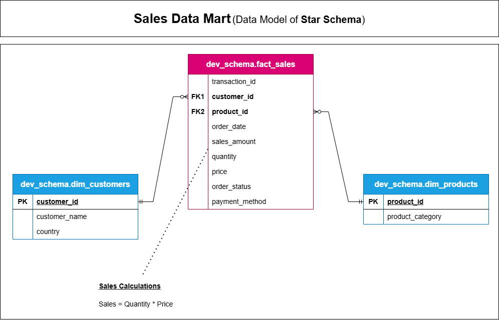

# 🎖️ DBT E-commerce Project | Medallion Data Warehouse

Welcome to the **DBT E-commerce Project** repository! 🚀
This project showcases a **Modern Data Stack** approach using **dbt** and **Medallion Architecture** to transform raw data into business-ready insights. It highlights industry best practices in **Data Engineering, ELT Pipelines, and Data Modeling**.

---

## 🏗️ Data Architecture

The data architecture for this project follows Medallion Architecture **Bronze**, **Silver**, and **Gold** layers:



1. **Bronze Layer**: Serves as the landing zone for raw data, using **dbt seed** to ingest CSV File into PostgreSQL Database.
2. **Silver Layer**: This layer leverages dbt for data cleansing and standardization to prepare data for analysis.
3. **Gold Layer**: Houses business-ready data modeled into a star schema required for reporting and analytics.

### 🧬 Data Lineage
The following graph illustrates the end-to-end data flow and transformations within dbt:



### ⭐ Data Modeling (Star Schema)
The Gold Layer is structured into a Star Schema to optimize query performance and analytical clarity:



---

## 📖 Project Overview

This project involves:

1. **Data Generation & Ingestion**: Creating a custom e-commerce dataset using Python and ingesting it via **dbt seed** into a PostgreSQL warehouse.
2. **Data Architecture**: Designing a Modern Data Warehouse Using Medallion Architecture **Bronze**, **Silver**, and **Gold** layers.
3. **Automated Transformations**: Leveraging **dbt** within **Docker** to automate transformations, including data cleansing and business logic application.
4. **Data Modeling**: Developing fact and dimension tables optimized for analytical queries.
5. **Data Delivery**: Provisioning clean, aggregated datasets to support BI reporting and advanced analytics.

---

## 🛠️ Tools & Technologies Used

- **Python**: Used for custom data generation.
- **SQL**: The core language for data manipulation and transformations.
- **DBT (Data Build Tool)**: Automating data transformations and maintaining lineage.
- **PostgreSQL**: Serving as the primary Database and Data Warehouse.
- **Docker & Docker Compose**: Ensuring a consistent and isolated environment for deployment.
- **Draw.io**: Utilized for designing data architecture and the **Star Schema** model.
- **Methodology**: Following the **Medallion Architecture** (Bronze, Silver, Gold).

---

## 🚀 Project Requirements

### Building the Data Warehouse (Data Engineering)

#### Objective
Develop a robust, automated data warehouse using PostgreSQL and dbt to transform raw e-commerce data into structured, business-ready insights.

#### Specifications
- **Data Source**: Generate a custom e-commerce dataset via Python to simulate real-world transactional scenarios and data quality challenges.
- **Data Quality**: Cleanse and resolve data quality issues prior to analysis.
- **Architecture**: Design a three-tier Medallion Architecture (Bronze, Silver, Gold) to ensure a clear and reliable data flow.
- **Dimensional Modeling**: Build a Star Schema consisting of optimized fact and dimension tables to simplify complex analytical queries.
- **Scalability & Isolation**: Use Docker to containerize the entire environment, ensuring the project is portable and easy to deploy.
- **Documentation** : Provide clear documentation of the data model to support both business stakeholders and analytics teams.

--- 

## 🔑 Key Features

- 🏗️ **Medallion Architecture**: A structured three-layer data flow (**Bronze**, **Silver**, **Gold**) ensures high data quality and reliability.
- ⚙️ **Automated Data Transformations**: Leveraging **dbt** to automate data cleansing and business logic, ensuring high data integrity.
- ⭐ **Dimensional Modeling**: Implementation of a **Star Schema** with optimized Fact and Dimension tables for high-performance analytics.
- 🐳 **Containerized Environment**: Entire stack is **built and run** via **isolated Docker containers**, ensuring consistency across development and deployment.
- 📝 **Lineage & Documentation**: Automated data lineage and documentation tracking through **dbt** to maintain transparency.

---

## 📂 Repository Structure

```
ecommerce-dbt-pipeline/                 # Repository Root
│
├── dataset/                            # Data generation source
│   └── generate_sales.py        
│
├── docs/                               # Project documentation and architecture details
│   ├── data_architecture.png    
│   ├── data_lineage.png         
│   └── data_model.png           
│
├── models/                             # DBT Models
│   ├── bronze/                         # Raw Data Ingestion 
│   │   └── ecommerce_sales_bronze.sql
│   ├── silver/                         # Data Transformation: Cleaning and standardization
│   │   └── ecommerce_sales_silver.sql
│   └── gold/                           # Data Modeling: Final analytical layer (Star Schema)
│       ├── dim_customers.sql
│       ├── dim_products.sql
│       └── fact_sales.sql
│
├── seeds/                              # Static CSV file loaded via "dbt seed"
│   └── ecommerce_sales.csv      
│
├── .gitignore                          # Files and directories to be ignored by Git
├── Dockerfile                          # Docker image configuration for dbt
├── docker-compose.yml                  # Docker services configuration
├── dbt_project.yml                     # Core dbt project configuration
├── LICENSE                             # License information for the repository
└── README.md                           # Project overview and documentation
```

---

## 🛡️ License

This project is licensed under the [MIT License](LICENSE). You are free to use, modify, and share this project with proper attribution.

---

## 🌟 About Me

Hi! I'm **Abdullah Emad**, a **Data Engineer** driven by a core mission: **Transforming raw data into reliable, actionable assets**.

I focus on architecting robust infrastructure that makes data clean, organized, and ready for action. I believe that well-architected data is the backbone of every great decision, and I’m dedicated to implementing best practices to ensure data quality and scalability.

Let’s connect to discuss data, insights, or professional opportunities:

[](https://www.linkedin.com/in/abdullah-emad-abdullah/)
